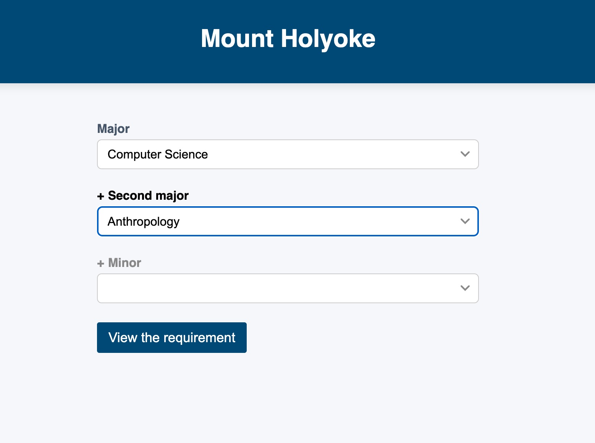
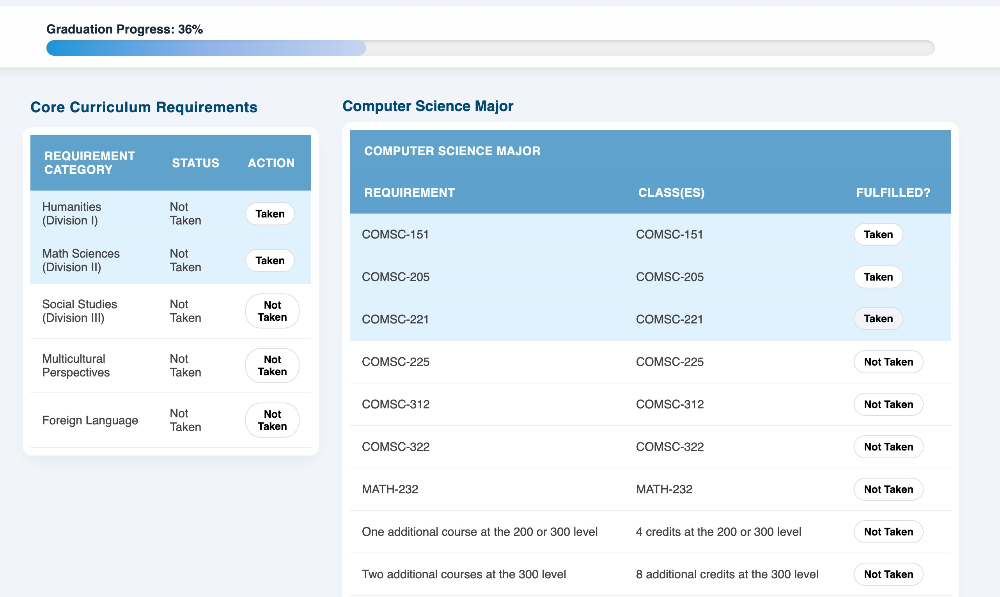

# Degree Progress Tracker for Mount Holyoke Students

A web-based tool that helps Mount Holyoke students visualize and track their degree progress.

## Features

- **Interactive Degree Dashboard**  
  View overall academic progress through a clean and structured interface.

- **Course Requirement Tracking**  
  Track completed, in-progress, and remaining degree requirements in organized course tables.

---

## Tech Stack

- HTML
- CSS
- JavaScript
- Flask

---

## Screenshots

  
  

---

## Future Improvements

- Expandable database integration
- Real-time grade analytics
- Personalized graduation requirement recommendations
- Authentication system for students and faculty
- Exportable academic reports
